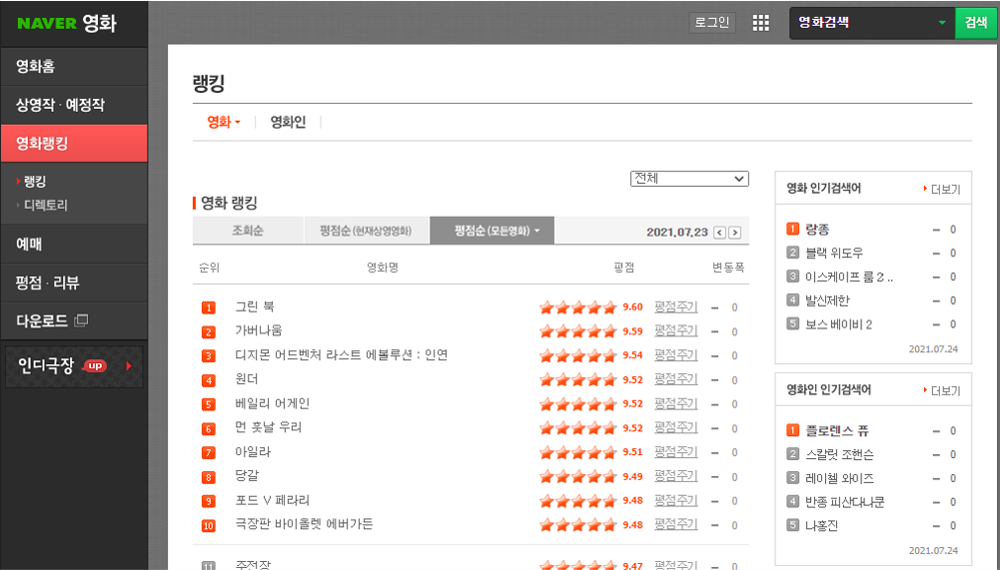
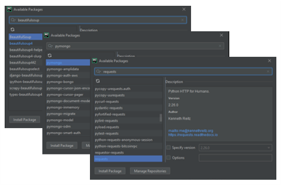
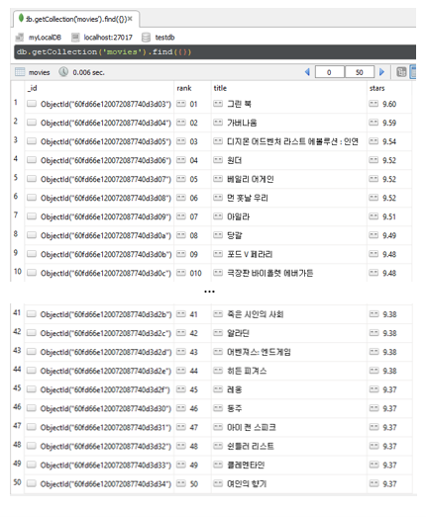

## 네이버 영화 랭킹, 제목, 평점 가져오기

네이버 영화 페이지에서 크롤링을 통해 데이터를 제어하고자 한다. [네이버 영화 바로가기](<https://movie.naver.com/movie/sdb/rank/rmovie.naver?sel=pnt&date=20210723>)

<br/>

🔽 파이썬에 requests, BeautifulSoup, pymongo 패키지를 설치한다.

<br/>

🔽 위 패키지들을 import 시키고, mongoDB client를 불러준다. database name은 'testdb'로 정했다.

```python
# crawling_movie_list.py
import requests
from bs4 import BeautifulSoup
from pymongo import MongoClient

client = MongoClient('localhost', 27017)
db = client.testdb
```

🔽 크롤링을 위해 기본 브라우저 속성을 잡아주고, 데이터를 받아온다.

```python
headers = {'User-Agent': 'Mozilla/5.0 (Windows NT 10.0; Win64; x64)AppleWebKit/537.36 (KHTML, like Gecko) Chrome/73.0.3683.86 Safari/537.36'}
data = requests.get('https://movie.naver.com/movie/sdb/rank/rmovie.nhn?sel=pnt&date=20210723', headers=headers)
```

🔽 위에서 본 네이버 영화 페이지의 전체 <html> 를 모두 가져온다

```python
soup = BeautifulSoup(data.text, 'html.parser')
```

🔽 이제 우리가 필요한 영화 제목들을 가져와보자.

크롤링한 source 코드를 보고 가져올 부분 근처를 보고, 가장 가까운 부모 id값을 찾아 #태그로 불러준다.

Chrome Browser를 이용하면 해당 부분에서 우클릭으로 copy > copy selector 기능을 통해 가져올 수 있다.

각 영화 정보는 <tr 태그> 안에 담겨져 있다.

```python
tr_tags = soup.select('#old_content > table > tbody > tr')
```

🔽 이제 영화 제목이 담긴 <a 태그> 부분을 가져온다.

```python
for tr in tr_tags:
    a_tag = tr.select_one('td.title > div > a')
```

🔽 네이버 영화 페이지에는 10개 영화마다 구분선이 존재하는데, 구분선도 <tr 태그> 안에 담겨 있기 때문에, for loop를 돌려 하위 값을 불러오고자하면 오류가 발생한다. 따라서 구분선 제외하는 작업이 필요하다.

구분선을 제외하고, 영화 제목을 출력해보면 아래와 같이 50개의 영화 제목이 출력된다.

```python
if a_tag is not None:
    title = a_tag.text
    print(title)
    
>> 그린 북
가버나움
디지몬 어드벤처 라스트 에볼루션 : 인연
...
쉰들러 리스트
클레멘타인
여인의 향기
```

🔽 제목이 잘 들어오는 것을 확인했다면, 이제 순위, 제목, 평점을 가져와보자.

순위는  안의 alt 속성안에 들어있고,
평점은 <td 태그> 중 class="point" 인 태그안에 들어있다.

결과를 확인하면 아래와 같이 rank, title, stars 순으로 출력해준다.

```python
if a_tag is not None:
    rank = tr.select_one('td:nth-child(1) > img')['alt']
    title = a_tag.text
    stars = tr.select_one('td.point').text

    print(rank, title, stars)

>> 01 그린 북 9.60
02 가버나움 9.59
03 디지몬 어드벤처 라스트 에볼루션 : 인연 9.54
...
48 쉰들러 리스트 9.37
49 클레멘타인 9.37
50 여인의 향기 9.37
```

🔽 이제 mongoDB에 넣어보자. 앞서 mongoDB에 testdb라는 collection을 만들어 두었다. 이제 아래 코드를 통해 movies라는 테이블을 만들고, 그 안에 영화 목록을 넣어보자.

영화 순위, 제목, 평점을 딕셔너리로 묶어주고 insert_one()을 통해 movies 테이블 안으로 인서트 해준다.

```python
if a_tag is not None:
    rank = tr.select_one('td:nth-child(1) > img')['alt']
    title = a_tag.text
    stars = tr.select_one('td.point').text

    # print(rank, title, stars)
    item = {
        'rank': rank,
        'title': title,
        'stars': stars
    }
    db.movies.insert_one(item)
```

🔽 MongoDB를 확인해보면 아래와 같이 들어오는 것을 볼 수 있다.

MongoDB를 확인하기 위해 'Robo 3T'라는 open-source MongoDB GUI를 사용했다. [Robo 3T 바로가기](<https://robomongo.org/>)

<br/>

🔽 전체 코드를 보면 다음과 같다.

```python
import requests
from bs4 import BeautifulSoup
from pymongo import MongoClient

client = MongoClient('localhost', 27017)
db = client.testdb

headers = {'User-Agent': 'Mozilla/5.0 (Windows NT 10.0; Win64; x64)AppleWebKit/537.36 (KHTML, like Gecko) '
                         'Chrome/73.0.3683.86 Safari/537.36'}
data = requests.get('https://movie.naver.com/movie/sdb/rank/rmovie.nhn?sel=pnt&date=20210723', headers=headers)

# 해당 페이지의 Elements 를 모두 가져오자
soup = BeautifulSoup(data.text, 'html.parser')

# 영화 제목들 가져오기 (.select)
tr_tags = soup.select('#old_content > table > tbody > tr')

for tr in tr_tags:
    # 책 제목이 담긴 <a 태그> 부분을 가져오자
    a_tag = tr.select_one('td.title > div > a')

    # week3-3 부분들이 None 처리되어 들어온다
    # None 부분들을 필터하고 제목들 가져오자
    if a_tag is not None:

        # rank, title, evaluation 확인하기
        # rank 값이 들어있는 부분인 를 가져오자
        # rank 값은 'alt' 속성에 담겨있다
        rank = tr.select_one('td:nth-child(1) > img')['alt']
        title = a_tag.text
        stars = tr.select_one('td.point').text

        item = {
            'rank': rank,
            'title': title,
            'stars': stars
        }
        db.movies.insert_one(item)
```
