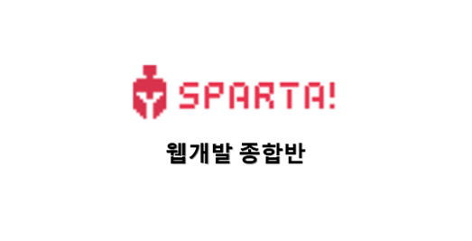
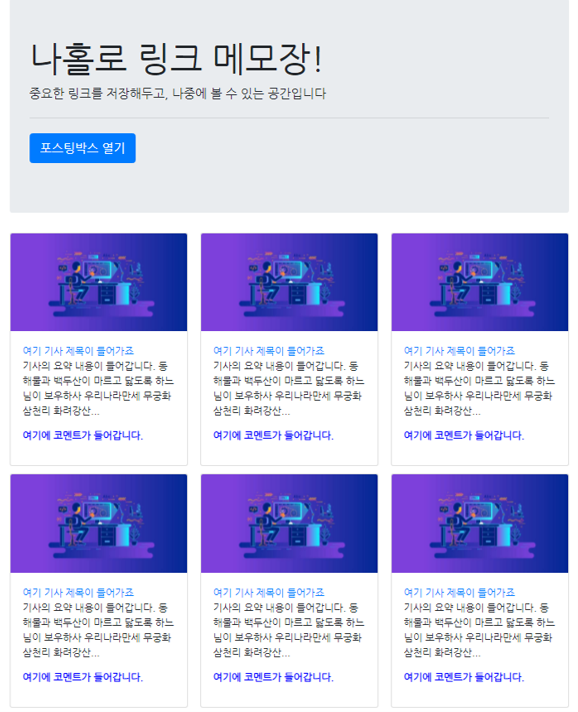

## 1주차 학습 내용

1주차 강의에서는 웹 개발의 가장 기본적인 내용들을 배우게 된다.

1. 서버와 클라이언트의 역할에 대한 설명
2. HTML, CSS, javaScript에 대한 설명
3. 부트스트랩 코드 이용하는 방법
4. 간단한 웹 페이지 작성하기
 

기본적인 내용인지라 2배속으로 후다닥보며 리캡할 수 있는 강의들이었다. 따라가기 전혀 어렵지 않고, 과제 또한 간단했으나 이 개발후기 과제가 제일 어려운것 같다. 개발 후기를 쓰는걸 블로그에서 종종 보긴했지만, 꾸준히 쓰는 분들을 보면 새삼 대단하게 느껴진다.
  

11일 완주 챌린지반을 수강하고 있는 본인은 정해진 시간에 (매일 8시~11시) [Gather](<https://www.gather.town/>)를 통해 온라인으로 만나 모각코를 하는 이들을 보게 되는데, 이게 나름 재미있는것 같다. 예전의 넥슨 바람의나라 같기도하고 [스파르타 코딩클럽](<https://spartacodingclub.kr>)의 재미 요소중 하나가 되겠다.

## 1주차 강의/과제

두 개의 간단한 웹 페이지 구현하게 된다.

1. 나홀로 링크 메모장

1. 상품 판매 주문 페이지

