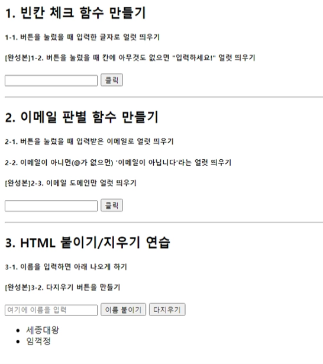
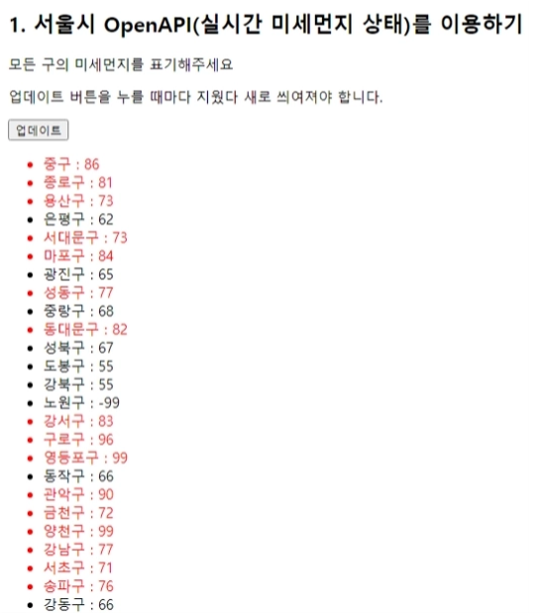
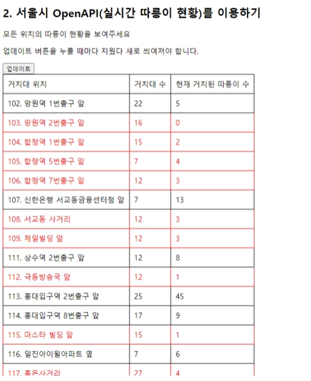
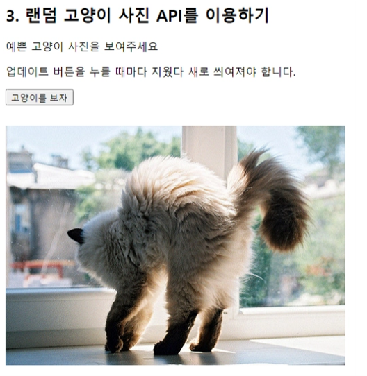

## 2주차 학습 내용

2주차 강의에서는 웹 개발의 가장 기본적인 내용들을 배우게 된다.

1. javaScript 문법 훈련
2. jQuery로 HTML 조작하기
3. Ajax로 서버 API 통신하기
 

프론트엔드를 React와 Electron으로 개발하는 Windows Application 개발로 시작했던터라, 항상 구글링을 하다보면 StackOverFlow 답변에 Ajax로 구현해 놓은 예제들을 볼 수 있었어서, 한번쯤은 해보고 싶었던 부분이었다.
  

강의 내용에서는 대부분 공공데이터를 Open API를 통해 GET으로 가져와서 필터링해서 쓰는 방법이므로 POST나 다른 부분들에 대한 부분은 추가적인 룩업을 해봐야 되겠다.
  

## 2주차 강의/과제

2주차 강의에서는 다음과 같은 결과물을 위한 코딩이 이루어지며, 디자인과는 거리가 멀어 추후 UI를 입혀 편집해 포스팅을 한번 해야겠다.

1. 함수 만들기

2. Open API 다루기 (서울시 실시간 미세먼지 상태)

3. Open API 다루기 (서울시 실시간 따릉이 현황)

4. Open API 다루기 (랜덤 고양이 사진 API)

 

2, 3번은 현재 앱으로 구현되어있고, 사람들이 사용하고 있어 나름 괜찮다고 생각했는데, 4번 고양이 사진 가져오기는 크게 실제로 써볼일을 없을 것 같다. 귀여우니 넘어가도록 한다.
