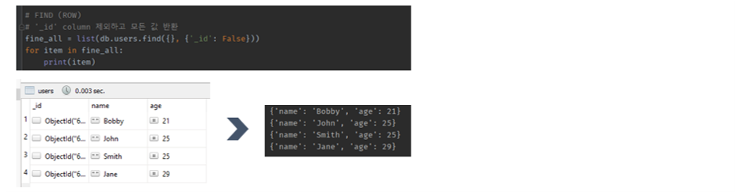

## 3주차 학습 내용

3주차 강의에서는 웹 개발의 가장 기본적인 내용들을 배우게 된다.

1. 파이썬 문법 훈련
2. 웹 페이지 크롤링
3. SQL과 NoSQL 특징
4. pymongo를 통한 mongoDB 제어
 

3주차 부터는 조금 더 익숙한 파이썬을 사용하게 된다.

반복문을 만들어 코드를 단순화하여 작업을 보다 편리하게 진행하게 되었다.

데이터 분석을 전공했지만, 태블로 엔지니어를 거쳐 현재 데스크탑 앱 개발을 하고 있다보니 크롤링할 일이 크게 없었다. 그래서 개인 프로젝트로 데이터 분석을 몇 가지 할 계획이었는데, 크롤링으로 데이터를 가져오는 방법으로 진행해보는 것도 좋겠다.
  

## 3주차 결과물

1. 네이버 영화 크롤링 후 mongoDB에 쌓기

2. pymongo를 이용해 mongoDB CRUD 해보기

 

3. 지니음악 사이트 크롤링 후 출력하기 [지니뮤직 바로가기](<https://www.genie.co.kr/chart/top200?ditc=D&rtm=N&ymd=20210724>)

