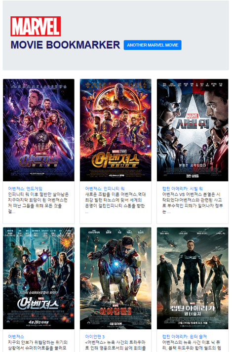
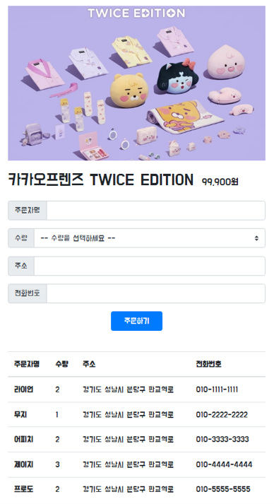

## 4주차 학습 내용

4주차 강의에서는 FLASK를 통한 서버와 클라이언트 통신을 주로 배운다.

1. Flask 프레임워크를 활용해서 API를 만들 수 있다.
2. '모두의책리뷰' API를 만들고 클라이언트에 연결한다.
3. '나홀로메모장' API를 만들고 클라이언트와 연결한다.
 

FLASK 프레임워크와 클라이언트 파일을 만들어 통신하게 되며, mongoDB와 데이터를 계속 저장하며 주고 받는다. 반복문을 보다 많이 활용하게 되어 어렵지 않게 따라갈 수 있었다.
 

## 4주차 결과물

1. 마블 영화 북마커 (flask + mongoDB)

 

2. 쇼핑몰 페이지 구성 (flask + mongoDB)

 
