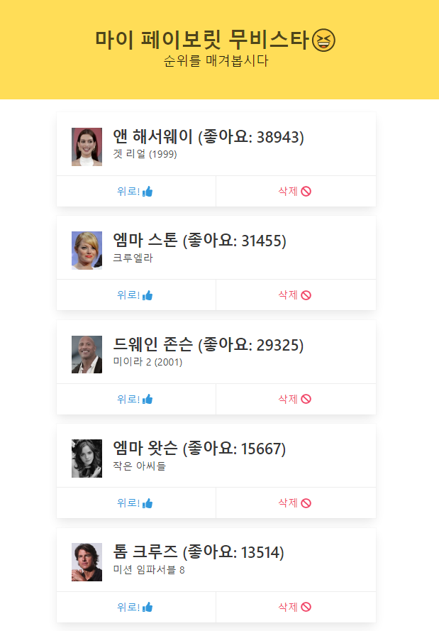
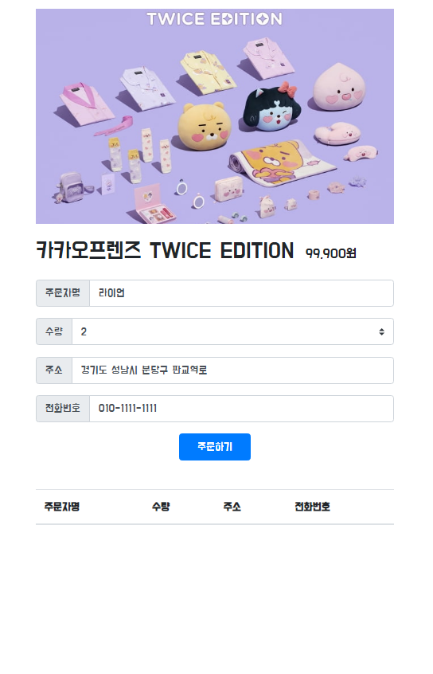
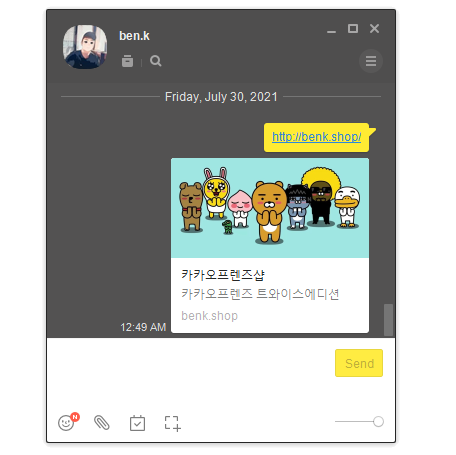

## 5주차 학습 내용

5주차 강의에서는 FLASK를 통한 서버와 클라이언트 통신을 주로 배운다.

1. Flask 프레임워크를 활용해서 API를 만들 수 있다.
2. '마이 페이보릿 무비스타'를 완성한다.
3. EC2에 내 프로젝트를 올린다.
 

FLASK 프레임워크와 클라이언트 파일을 만들어 통신하게 되며, mongoDB와 데이터를 계속 저장하며 주고 받는다. 반복문을 보다 많이 활용하게 되어 어렵지 않게 따라갈 수 있었다.
 

## 5주차 결과물

1. My Favorite Movie Star

 

1. 카카오프렌즈 샵

 

3. 카카오프렌즈 샵 og 설정

 
